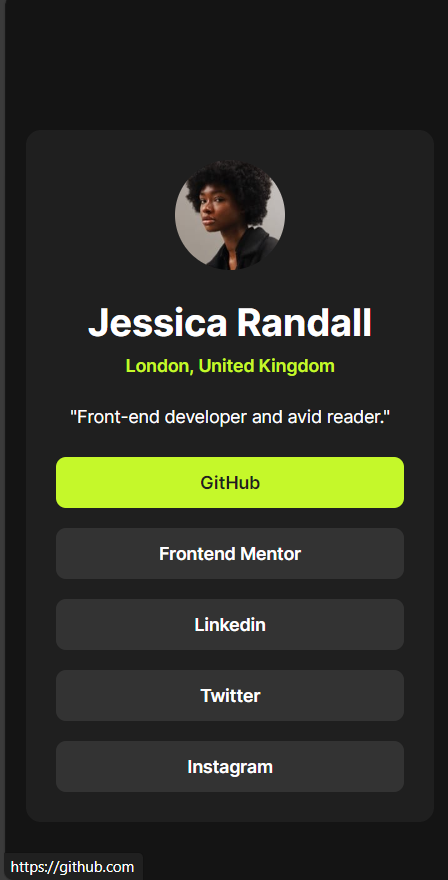

# Frontend Mentor - Social links profile solution

This is a solution to the [Social links profile challenge on Frontend Mentor](https://www.frontendmentor.io/challenges/social-links-profile-UG32l9m6dQ). Frontend Mentor challenges help you improve your coding skills by building realistic projects. 

## Table of contents

- [Overview](#overview)
  - [The challenge](#the-challenge)
  - [Screenshot](#screenshot)
  - [Links](#links)
- [My process](#my-process)
  - [Built with](#built-with)
  - [What I learned](#what-i-learned)
  - [Continued development](#continued-development)

## Overview

### The challenge

Users should be able to:

- See hover and focus states for all interactive elements on the page

### Screenshot

*Dekstop Screen - 1440px*

*Mobile Screen - 375px*

### Links

- Solution URL: [Add solution URL here](https://your-solution-url.com)
- Live Site URL: [Add live site URL here](https://your-live-site-url.com)

## My process

### Built with

- Angular 17
- SCSS
- Typescript

### What I learned

This project of developing a link card for social media networks was an enriching experience that allowed me to explore not only Angular's functionalities but also to enhance my knowledge in web development in general.

It's important to highlight that given the relatively simple scope of the project, it would have been perfectly feasible to implement it using only HTML, CSS, and JavaScript. However, I chose to use Angular as the development platform. Why? Simply for the sake of practice and deepening my understanding.

#### Exploring New Horizons with Angular:
By opting for Angular for this project, I challenged myself to utilize a more robust, component-based application structure. This allowed me to explore Angular's architecture, learn how to better organize code, and understand how different elements of the framework interact with each other.

#### Leveraging Angular Features:
While the project itself was relatively straightforward - displaying links to social media platforms on a card - I seized the opportunity to delve deeper into Angular's features. I used directives like **\*ngFor** for dynamic link repetition and property binding to update element properties as needed. These practices not only made the code more efficient but also familiarized me with Angular's essential concepts.

#### The Importance of Practice:
The decision to implement this project in Angular wasn't just a matter of technology choice, but rather a learning opportunity. Practice is crucial for developing programming skills, and choosing challenges beyond the basics is essential for professional growth.
